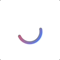

# NextSwiftUI
Make beautiful SwiftUI apps regardless of your design experience.

## Introduction
### What is NextSwiftUI?
NextSwiftUI is a UI library for SwiftUI that helps you build beautiful and accessible user interfaces. 

NextSwiftUI's primary goal is to streamline the development process, offering a beautiful and adaptable system design for an enhanced user experience.

## Components
### CircularProgressView
Circular progress views are utilized to indicate an undetermined wait period or visually represent the duration of a process.
#### Usage
```swift
CircularProgressView()
```
