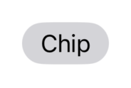
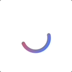
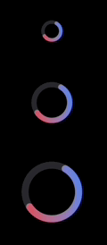
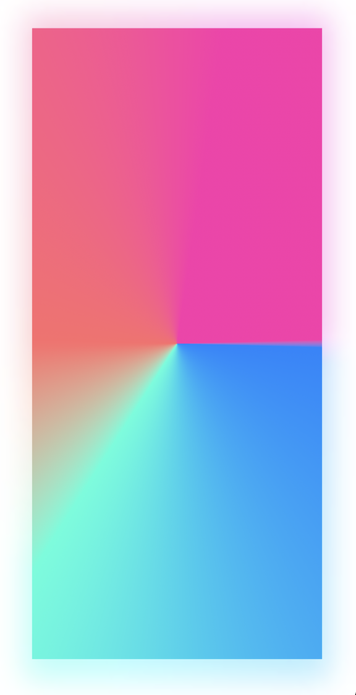

# NextSwiftUI
Make beautiful SwiftUI apps regardless of your design experience.

## Introduction
### What is NextSwiftUI?
NextSwiftUI is a UI library for SwiftUI that helps you build beautiful and accessible user interfaces. 

NextSwiftUI's primary goal is to streamline the development process, offering a beautiful and adaptable system design for an enhanced user experience.

## Components
### Chip
A Chip is a small block of essential information that represent an input, attribute, or action.
#### Usage
```swift
Chip(Text("Chip"))
````

### CircularProgressView
Circular progress views are utilized to indicate an undetermined wait period or visually represent the duration of a process.
#### Usage
```swift
CircularProgressView()
```

#### Sizes
```swift
import NextSwiftUI

struct ContentView: View {
    var body: some View {
        VStack {
            CircularProgressView(size: .small)
            CircularProgressView(size: .medium)
            CircularProgressView(size: .large)
        }
    }
}
```

#### With Value
```swift
import NextSwiftUI

struct ContentView: View {
    var body: some View {
        CircularProgressView(value: 0.6)
    }
}
```

### NextImage
The NextImage view is used to display images.
#### Usage
```swift
NextImage(url: .init(string: "https://images.unsplash.com/photo-1665475998014-dc2ae4e93af2"))
```
#### Animated Loading
NextImage has a built-in shimming animation to indicate the image is loading and an default animation when the image loads.


### Skeleton
Skeleton is a placeholder to show a loading state and the expected shape of a view.
#### Usage
```swift
Skeleton(Color.next.default300)
```

## Modifiers
### Blurred
You can use the blurred view modifier to duplicate the view and blur it to create a blurred effect.
#### Usage
```swift
AngularGradient.next.anguar
    .blurred()
```

